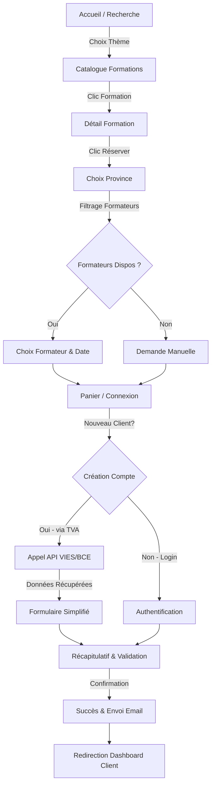
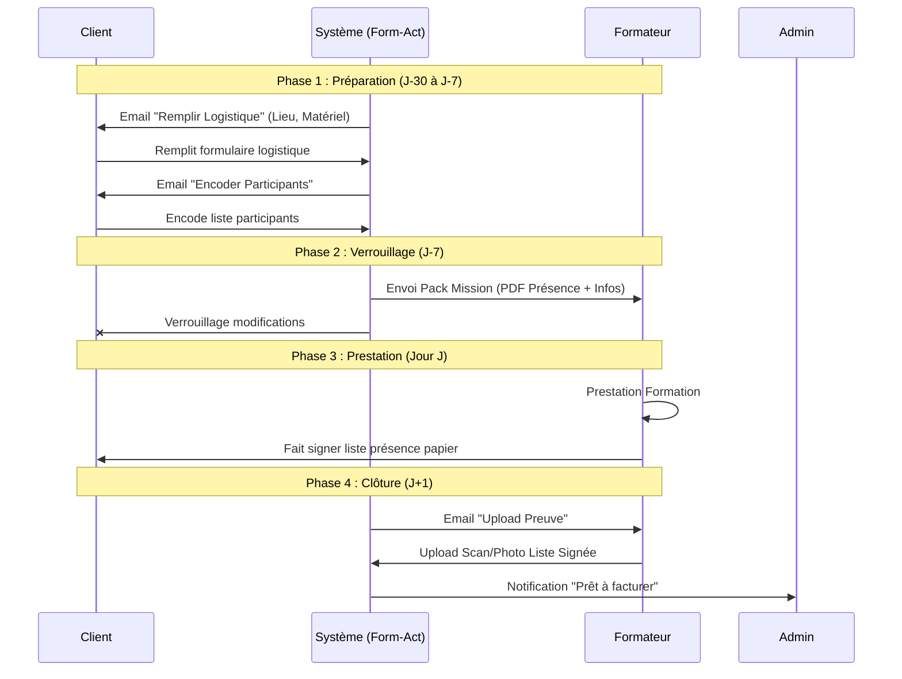

# 📐 Wireframes Fonctionnels & Flux Utilisateurs

Ce document décrit la structure logique des écrans et les parcours utilisateurs avant tout développement. Il sert de référence pour le design et l'implémentation.

---

## 1. Flux Utilisateurs (User Journeys)

### 1.1. Tunnel de Réservation (Client)
Ce diagramme illustre le parcours d'un client, de la recherche à la confirmation.

### 1.2. Cycle de Vie Logistique (Workflow)
Ce diagramme montre les interactions après la réservation entre le Client, le Formateur et le Système.

---

## 2. Description des Écrans (Wireframes Textuels)

### 2.1. Espace Public

#### 🏠 Page d'Accueil (`/`)
*   **Header** : Logo, Nav (Catalogue, Connexion), CTA "Espace Formateur".
*   **Hero Section** :
    *   Titre : "Trouvez votre formation en entreprise".
    *   **Moteur de Recherche** :
        *   Dropdown "Thème" (Bureautique, Soft Skills, IA...).
        *   *(Pas de filtre région ici)*.
        *   Bouton "Rechercher".
*   **Réassurance** : "Formateurs certifiés", "Prix tout compris", "Gestion simplifiée".

#### 📚 Catalogue (`/catalogue`)
*   **Sidebar Filtres** :
    *   Thématiques.
    *   Durée (Demi-journée / Journée).
    *   *(Pas de filtre région)*.
*   **Grille Formations** :
    *   Cartes : Image, Titre, Badges (Niveau, Durée), Prix indicatif "à partir de...".
    *   Bouton "Voir dates".

#### 📄 Détail Formation (`/formation/[id]`)
*   **En-tête** : Titre, Description courte, Prix.
*   **Onglets** :
    *   *Programme* : Contenu détaillé (Liste à puces).
    *   *Objectifs* : Ce que vous saurez faire.
    *   *Pré-requis* : Matériel ou connaissances nécessaires.
*   **Bloc Réservation (Sticky)** :
    *   Bouton **"Réserver cette formation"**.
    *   **Étape 1 : Localisation** (Pop-up ou Slide-in) :
        *   Sélecteur "Votre Province" (Obligatoire).
        *   *Action* : Filtre les formateurs disponibles.
    *   **Étape 2 : Choix Formateur & Date** :
        *   Liste des experts de la zone.
        *   Calendrier des disponibilités.
    *   **Cas "Aucun formateur trouvé"** (Zone Désert) :
        *   Message : "Aucun expert disponible automatiquement dans votre zone."
        *   Bouton : **"Demande de prise en charge manuelle"**.

#### ✅ Confirmation / Succès (`/checkout/success`)
*   **Message Rassurant** : "Votre demande de réservation est confirmée !".
*   **Récapitulatif Commande** : Date, Formateur, Prix estimé.
*   **Call To Action (Next Step)** :
    *   "Complétez les infos logistiques maintenant" (Bouton principal).
    *   "Aller à mon tableau de bord" (Bouton secondaire).

---

### 2.2. Espace Client

#### 🔐 Login / Inscription (`/login` & `/register`)
*   **Inscription** :
    *   Champ unique : **Numéro de TVA**.
    *   Bouton "Rechercher".
    *   *Option* : "Saisir mes coordonnées manuellement" (si API indisponible).
    *   *Affichage dynamique* : Nom Entreprise, Adresse (non modifiable), Champ Email, Champ Mot de passe.
    *   Checkbox "J'accepte les CGV".
    *   *Note* : Flux "Tunnel Direct" (Checkout). Le choix de date est conservé en session pendant le login.

#### 🔑 Mot de Passe Oublié (`/forgot-password`)
*   **Formulaire Simple** :
    *   Input Email.
    *   Bouton "Réinitialiser".
*   **Feedback** : "Si ce compte existe, un lien a été envoyé."

#### 📊 Dashboard Client (`/dashboard/client`)
*   **KPIs** : Formations à venir (nb), Actions requises (nb).
*   **Timeline Sessions** :
    *   Liste chronologique.
    *   Statuts visuels : 🔴 "Logistique manquante", 🟠 "Participants manquants", 🟢 "Prêt", 🔵 "Terminé".
    *   Action : Bouton "Gérer" sur chaque ligne.

#### 🏢 Profil & Facturation (`/dashboard/client/profil`)
*   **Coordonnées** :
    *   Nom Entreprise, N° TVA (Modifiable avec re-validation VIES).
    *   Adresse Siège.
*   **Contacts** :
    *   Email Principal.
    *   Email Comptabilité (pour envoi factures).
*   **Historique** : Liste des modifications (Audit log).

#### 📝 Fiche Session / Logistique (`/dashboard/client/session/[id]`)
*   **État** : Barre de progression (Commande > Logistique > Participants > Terminé).
*   **Bloc 1 : Lieu & Accueil**
    *   Adresse (Google Places).
    *   Instructions d'accès (Code porte, étage...).
*   **Bloc 2 : Matériel**
    *   Checkboxes : Projecteur, Paperboard, Wifi Invité.
*   **Bloc 3 : Participants**
    *   Tableau simple : Nom, Prénom, Email.
    *   Bouton "Ajouter ligne".
    *   Bouton "Importer CSV" (Nice to have).
*   **Action** : Bouton "Enregistrer". (Devient inactif à J-7).

---

### 2.3. Espace Formateur

#### 📱 Dashboard Formateur (`/dashboard/formateur`)
*   **Vue Mobile First**.
*   **Prochaine Mission** (En gros) :
    *   Date, Heure.
    *   Client, Ville.
    *   Bouton "Y aller" (Waze/Maps).
    *   Bouton "Détails".
*   **Mon Profil / Disponibilités** :
    *   Champ Input : **"Lien iCal (Google/Outlook)"** pour synchronisation auto.
    *   Bouton "Éditer ma Bio / Photo".
    *   Switch : "Me déclarer indisponible temporairement".
*   **Calendrier** :
    *   Vue agenda simple.
    *   Indicateurs de missions.
    *   Bouton "+" pour ajouter une indisponibilité (Congé).

#### 📤 Upload Preuve (`/dashboard/formateur/mission/[id]/upload`)
*   **Contexte** : Rappel nom formation et date.
*   **Zone de Drop** : "Prendre une photo ou déposer le PDF signé".
*   **Validation** : Prévisualisation image.
*   Bouton "Envoyer et Clôturer".

#### 💰 Reporting & Honoraires (`/dashboard/formateur/reporting`)
*   **Sélecteur Mois** : (ex: Octobre 2023).
*   **Synthèse** :
    *   Total Missions effectuées.
    *   Total Km parcourus.
    *   Estimation Honoraires HT.
*   **Liste Détaillée** : Date / Client / Km / Montant.

---

### 2.4. Espace Admin (Back-Office)

#### 📅 Master Calendar (`/admin/calendar`)
*   Vue "Ressources" (FullCalendar ou équivalent).
*   Lignes = Formateurs.
*   Colonnes = Jours.
*   Drag & Drop possible pour déplacer une mission (avec alerte mail auto).

#### 💼 Gestion Catalogue (`/admin/catalogue`)
*   CRUD Formations.
*   Gestion des liaisons Formateurs <-> Zones <-> Formations.
*   Paramétrage des prix de base.

#### 🔧 Interface de Forçage (Modale Admin sur Session)
*   **Actions Critiques** :
    *   Bouton "Déverrouiller Logistique" (Permet au client de modifier à J-1).
    *   Bouton "Changer Formateur" (Ignore règles géographiques).
    *   Bouton "Annuler Session" (Avec motif + Email auto).

#### 💶 Odoo Prep (`/admin/odoo-prep`)
*   **File d'attente** : Liste sessions terminées avec preuve uploadée.
*   **Vue Détail Dossier** :
    *   Vérification Données Facturation (TVA, Adresse).
    *   Ajustement Prix Final (+/- Remise, + Frais Km).
    *   Vérification Montant HTVA.
*   **Action Finale** : Bouton "Marquer comme Facturé & Archiver".
